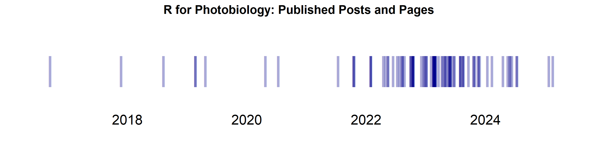
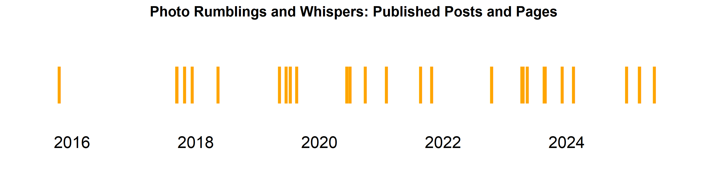

<!-- README.md is generated from README.Rmd. Please edit that file -->

## Computing-related Skills

Programing: R, (Python), C++, (Java), C, bash, awk, Perl, sh, (FORTRAN),
Modula-2, Pascal, BASIC, Forth.

Text mark up: $\LaTeX$, $\TeX$, Quarto, Rmarkdown, markdown, HTML.

Revision control systems: git, svn, (cvs), rss.

Drafting: Inkscape, OpenSCAD, Adobe Illustrator.

Image/photography: Capture One, Helicon Focus, Lumariver Profile
Designer, RawDigger, VueScan, LightRoom, Photoshop.

Video- and interactive tutorials: FlashBack Pro, R shiny.

## IDE/GUI’s I like

WinEdt (for $\LaTeX$, $\TeX$, with embedded R code or not), RStudio (for
R scripts, Quarto and Rmarkdown), GitKraken (for git).

## Elsewhere

ORCID profile: <a href="https://orcid.org/0000-0003-3385-972X">

https://orcid.org/0000-0003-3385-972X </a>

Web site for the book [Learn R: As a
Language](https://www.learnr-book.info/).

## R Packages

The sources of the R packages I have published are in public Git
repositories at GitHub. Out of the packages that I have authored and
maintain, 14 are currently available through CRAN. The total number of
packages submissions (mostly updates) as author and maintainer is 206
since 2016-01-29.

I have published in CRAN one package update roughly every 16 days, or
about 1.93 package updates per month, since 2016-01-29.

The most recent of these updates was published in CRAN on 2024-09-14.

📂 Click to expand a list of my packages at CRAN with the most recently
updated one at the top.

| R package | Title | Version | Date |
|:---|:---|:---|:---|
| photobiologyInOut | [Read Spectral and Logged Data from Foreign Files](https://doi.org/10.32614/CRAN.package.photobiologyInOut) | 0.4.28-1 | 2024-09-14 |
| ggspectra | [Extensions to ‘ggplot2’ for Radiation Spectra](https://doi.org/10.32614/CRAN.package.ggspectra) | 0.3.13 | 2024-09-13 |
| photobiology | [Photobiological Calculations](https://doi.org/10.32614/CRAN.package.photobiology) | 0.11.3 | 2024-08-25 |
| ggpp | [Grammar Extensions to ‘ggplot2’](https://doi.org/10.32614/CRAN.package.ggpp) | 0.5.8-1 | 2024-07-01 |
| ggpmisc | [Miscellaneous Extensions to ‘ggplot2’](https://doi.org/10.32614/CRAN.package.ggpmisc) | 0.6.0 | 2024-06-28 |
| gginnards | [Explore the Innards of ‘ggplot2’ Objects](https://doi.org/10.32614/CRAN.package.gginnards) | 0.2.0 | 2024-05-01 |
| learnrbook | [Datasets and Code Examples from P. J. Aphalo’s “Learn R” Book](https://doi.org/10.32614/CRAN.package.learnrbook) | 2.0.1 | 2024-04-28 |
| photobiologyPlants | [Plant Photobiology Related Functions and Data](https://doi.org/10.32614/CRAN.package.photobiologyPlants) | 0.5.0 | 2024-04-02 |
| photobiologySun | [Data for Sunlight Spectra](https://doi.org/10.32614/CRAN.package.photobiologySun) | 0.5.0 | 2024-04-01 |
| photobiologyFilters | [Spectral Transmittance and Spectral Reflectance Data](https://doi.org/10.32614/CRAN.package.photobiologyFilters) | 0.6.0 | 2024-02-27 |
| photobiologyLEDs | [Spectral Data for Light-Emitting-Diodes](https://doi.org/10.32614/CRAN.package.photobiologyLEDs) | 0.5.2 | 2023-11-01 |
| photobiologyLamps | [Spectral Irradiance Data for Lamps](https://doi.org/10.32614/CRAN.package.photobiologyLamps) | 0.5.2 | 2023-10-24 |
| photobiologySensors | [Response Data for Light Sensors](https://doi.org/10.32614/CRAN.package.photobiologySensors) | 0.5.1 | 2023-10-24 |
| photobiologyWavebands | [Waveband Definitions for UV, VIS, and IR Radiation](https://doi.org/10.32614/CRAN.package.photobiologyWavebands) | 0.5.2 | 2023-10-24 |

Updates under development are published at R-Universe as soon as merged
or commited into the main branch in the repositories at GitHub. Two
packages that depend on a commercial closed-source driver, but usable
with a free runtime of the driver, are published only at R-Universe.

R-Universe profile: <https://aphalo.r-universe.dev>. 

## Posts and Pages at [R for Photobiology](https://www.r4photobiology.info/)

The site [R for Photobiology](https://www.r4photobiology.info) contains
95 posts and pages published since 2016-09-15! I have recently rebuilt
the site using Quarto, and I have transferred only some of the posts
originally published using WordPress. I am slowly adding more old posts,
but only those that remain relevant. The figure below shows original
publication date even when posts have been later updated. The source
files are in a [public repository at
GitHub](https://github.com/aphalo/r4p-blog).

I have published one post or page roughly every days, or about 1.0 posts
per month, since 2016-09-15.

I published the most recent post 112 days ago.

📂 Click to expand a full list of posts.

| Date | Title |
|:---|:---|
| 2024-07-13 | [“R Packages: Timeline of Updates”](https://www.r4photobiology.info/C:/Users/aphalo/Documents/R-web-blog/r4p-blog/pages/CRAN-activity.html) |
| 2024-07-10 | [“Multichannel LED arrays”](https://www.r4photobiology.info/C:/Users/aphalo/Documents/R-web-blog/r4p-blog/senpep-posts/led-arrays.html) |
| 2024-06-11 | [“Move from Wordpress to Quarto”](https://www.r4photobiology.info/C:/Users/aphalo/Documents/R-web-blog/r4p-blog/senpep-posts/index.html) |
| 2024-06-01 | [“Fitted-model labels in Markdown”](https://www.r4photobiology.info/C:/Users/aphalo/Documents/R-web-blog/r4p-blog/galleries/plot-equations-markdown.html) |
| 2024-05-28 | [“Looking back 40 years”](https://www.r4photobiology.info/C:/Users/aphalo/Documents/R-web-blog/r4p-blog/presentations/research-40-years.html) |
| 2024-05-16 | [“Is this a polynomial?”](https://www.r4photobiology.info/C:/Users/aphalo/Documents/R-web-blog/r4p-blog/posts/is-this-a-polynomial.html) |
| 2024-04-17 | [“Annotating Plot Matrices”](https://www.r4photobiology.info/C:/Users/aphalo/Documents/R-web-blog/r4p-blog/galleries/ggally-ggpairs.html) |
| 2024-02-10 | [“Repository migrated to R-Universe”](https://www.r4photobiology.info/C:/Users/aphalo/Documents/R-web-blog/r4p-blog/posts/web-site-news/move-to-r-universe.html) |
| 2024-01-13 | [“ooacquire: Spectral Irradiance Algorithms”](https://www.r4photobiology.info/C:/Users/aphalo/Documents/R-web-blog/r4p-blog/pages/ooacquire-algorithms.html) |
| 2023-11-27 | [“Linear Models”](https://www.r4photobiology.info/C:/Users/aphalo/Documents/R-web-blog/r4p-blog/pages/linear-models-intro.html) |
| 2023-11-21 | [“Theoretical probability distributions”](https://www.r4photobiology.info/C:/Users/aphalo/Documents/R-web-blog/r4p-blog/pages/theoretical-probability-distributions.html) |
| 2023-11-18 | [“Flow of code execution”](https://www.r4photobiology.info/C:/Users/aphalo/Documents/R-web-blog/r4p-blog/pages/r-flow-execution.html) |
| 2023-10-30 | [“Introduction to Data Visualization”](https://www.r4photobiology.info/C:/Users/aphalo/Documents/R-web-blog/r4p-blog/galleries/dataviz-intro.html) |
| 2023-10-21 | [“photobiology 0.11.x”](https://www.r4photobiology.info/C:/Users/aphalo/Documents/R-web-blog/r4p-blog/posts/photobiology/photobiology-0.11.x.html) |
| 2023-10-21 | [“Design of Experiments”](https://www.r4photobiology.info/C:/Users/aphalo/Documents/R-web-blog/r4p-blog/pages/design-exp-principles.html) |
| 2023-09-19 | [“R at its simplest”](https://www.r4photobiology.info/C:/Users/aphalo/Documents/R-web-blog/r4p-blog/pages/R-intro.html) |
| 2023-08-19 | [“Research as a process”](https://www.r4photobiology.info/C:/Users/aphalo/Documents/R-web-blog/r4p-blog/senpep-posts/approaches-to-research.html) |
| 2023-08-19 | [“Research as a process”](https://www.r4photobiology.info/C:/Users/aphalo/Documents/R-web-blog/r4p-blog/pages/approaches-to-research.html) |
| 2023-08-14 | [“Multiple comparisons with ggpmisc”](https://www.r4photobiology.info/C:/Users/aphalo/Documents/R-web-blog/r4p-blog/galleries/multcomp.html) |
| 2023-08-01 | [“Pairwise labels with ggpp”](https://www.r4photobiology.info/C:/Users/aphalo/Documents/R-web-blog/r4p-blog/galleries/pairwise-labels.html) |
| 2023-07-31 | [“Open Access Weather and Climate Data”](https://www.r4photobiology.info/C:/Users/aphalo/Documents/R-web-blog/r4p-blog/galleries/online-weather-data.html) |
| 2023-07-30 | [“Timelines with ggplot2”](https://www.r4photobiology.info/C:/Users/aphalo/Documents/R-web-blog/r4p-blog/galleries/plot-timeline.html) |
| 2023-06-25 | [“Fitted-model labels with ggpmisc and plotly”](https://www.r4photobiology.info/C:/Users/aphalo/Documents/R-web-blog/r4p-blog/galleries/plot-interactive.html) |
| 2023-06-24 | [“Fitted-model labels with ggpmisc and gganimate”](https://www.r4photobiology.info/C:/Users/aphalo/Documents/R-web-blog/r4p-blog/galleries/plot-animation.html) |
| 2023-06-10 | [“ooacquire \>= 0.4.0”](https://www.r4photobiology.info/C:/Users/aphalo/Documents/R-web-blog/r4p-blog/posts/ooacquire/ooacquire-0.4.x.html) |
| 2023-06-02 | [“Functional analysis of spectra with photobiology to fda.usc”](https://www.r4photobiology.info/C:/Users/aphalo/Documents/R-web-blog/r4p-blog/galleries/photobiology/functional-data-analysis.html) |
| 2023-05-30 | [“Model fitting in R”](https://www.r4photobiology.info/C:/Users/aphalo/Documents/R-web-blog/r4p-blog/pages/R-model-fitting-intro.html) |
| 2023-05-30 | [“Randomization and independent replicates”](https://www.r4photobiology.info/C:/Users/aphalo/Documents/R-web-blog/r4p-blog/pages/design-exp-intro.html) |
| 2023-05-28 | [“photobiology 0.10.1x”](https://www.r4photobiology.info/C:/Users/aphalo/Documents/R-web-blog/r4p-blog/posts/photobiology/photobiology-0.10.1x.html) |
| 2023-05-24 | [“EDA with ggplot2”](https://www.r4photobiology.info/C:/Users/aphalo/Documents/R-web-blog/r4p-blog/pages/ggplot2-EDA.html) |
| 2023-05-21 | [“I have started using Mastodon…”](https://www.r4photobiology.info/C:/Users/aphalo/Documents/R-web-blog/r4p-blog/posts/Mastodon-updates/index.html) |
| 2023-05-11 | [“Plant photoreceptors”](https://www.r4photobiology.info/C:/Users/aphalo/Documents/R-web-blog/r4p-blog/galleries/photobiology/plant-photoreceptors.html) |
| 2023-05-03 | [“ggplot2 Basics”](https://www.r4photobiology.info/C:/Users/aphalo/Documents/R-web-blog/r4p-blog/pages/ggplot2-introduction.html) |
| 2023-04-27 | [“Spectral fluorescence with ooacquire”](https://www.r4photobiology.info/C:/Users/aphalo/Documents/R-web-blog/r4p-blog/pages/spectral-fluorescence/index.html) |
| 2023-04-27 | [“ooacquire: Spectral Irradiance Measurement”](https://www.r4photobiology.info/C:/Users/aphalo/Documents/R-web-blog/r4p-blog/pages/acq-irrad-tutorial.html) |
| 2023-04-15 | [“Weather data for Finland from FMI”](https://www.r4photobiology.info/C:/Users/aphalo/Documents/R-web-blog/r4p-blog/galleries/fmi-kumpula.html) |
| 2023-04-10 | [“ooacquire 0.3.x”](https://www.r4photobiology.info/C:/Users/aphalo/Documents/R-web-blog/r4p-blog/posts/ooacquire/ooacquire-0.3.x.html) |
| 2023-03-20 | [“OmniDriver, Java and the whims of companies”](https://www.r4photobiology.info/C:/Users/aphalo/Documents/R-web-blog/r4p-blog/pages/OmniDriver-Java.html) |
| 2023-03-04 | [“R Packages”](https://www.r4photobiology.info/C:/Users/aphalo/Documents/R-web-blog/r4p-blog/pages/packages-status.html) |
| 2023-02-28 | [“Packages ggpmisc, ggpp and gginnards”](https://www.r4photobiology.info/C:/Users/aphalo/Documents/R-web-blog/r4p-blog/pages/ggpmisc-intro.html) |
| 2023-02-28 | [“Nudging + repulsion with ggrepel and ggpp”](https://www.r4photobiology.info/C:/Users/aphalo/Documents/R-web-blog/r4p-blog/galleries/nudge-and-repel.html) |
| 2023-02-27 | [“Website migrated to Quarto”](https://www.r4photobiology.info/C:/Users/aphalo/Documents/R-web-blog/r4p-blog/posts/web-site-news/move-to-quarto.html) |
| 2023-02-27 | [“Fitted-model labels with ggpmisc”](https://www.r4photobiology.info/C:/Users/aphalo/Documents/R-web-blog/r4p-blog/galleries/plot-equations.html) |
| 2023-02-25 | [“Volcano and quadrant plots with ggpmisc”](https://www.r4photobiology.info/C:/Users/aphalo/Documents/R-web-blog/r4p-blog/galleries/quadrant-volcano-plots.html) |
| 2023-02-25 | [“Data labels in bar plots with ggpp”](https://www.r4photobiology.info/C:/Users/aphalo/Documents/R-web-blog/r4p-blog/galleries/bar-col-plots.html) |
| 2023-02-23 | [“ggplot insets with package ggpp”](https://www.r4photobiology.info/C:/Users/aphalo/Documents/R-web-blog/r4p-blog/galleries/plot-insets.html) |
| 2023-02-20 | [“Handbook on photobiological calculations with R”](https://www.r4photobiology.info/C:/Users/aphalo/Documents/R-web-blog/r4p-blog/pages/r4p-book.html) |
| 2023-02-20 | [“A handbook of best practice in plant UV photobiology”](https://www.r4photobiology.info/C:/Users/aphalo/Documents/R-web-blog/r4p-blog/pages/beyond-the-visible.html) |
| 2023-02-19 | [“The R for Photobiology Suite”](https://www.r4photobiology.info/C:/Users/aphalo/Documents/R-web-blog/r4p-blog/pages/r4p-introduction.html) |
| 2023-02-19 | [“Pedro J. Aphalo”](https://www.r4photobiology.info/C:/Users/aphalo/Documents/R-web-blog/r4p-blog/about/pedro.html) |
| 2023-02-18 | [“R, RStudio and Quarto”](https://www.r4photobiology.info/C:/Users/aphalo/Documents/R-web-blog/r4p-blog/pages/upgrading-R.html) |
| 2023-02-18 | [“Support”](https://www.r4photobiology.info/C:/Users/aphalo/Documents/R-web-blog/r4p-blog/about/help.html) |
| 2023-02-15 | [“About this Website”](https://www.r4photobiology.info/C:/Users/aphalo/Documents/R-web-blog/r4p-blog/about/about.html) |
| 2023-02-03 | [“ggspectra \>= 0.3.10”](https://www.r4photobiology.info/C:/Users/aphalo/Documents/R-web-blog/r4p-blog/posts/ggspectra/ggspectra-0.3.10.html) |
| 2023-01-05 | [“photobiologyWavebands 0.5.1”](https://www.r4photobiology.info/C:/Users/aphalo/Documents/R-web-blog/r4p-blog/posts/photobiologyWavebands/photobiologyWavebands-0.5.1.html) |
| 2023-01-05 | [“photobiology 0.10.15”](https://www.r4photobiology.info/C:/Users/aphalo/Documents/R-web-blog/r4p-blog/posts/photobiology/photobiology-0.10.15.html) |
| 2022-12-30 | [“Are plants and plant canopies flat?”](https://www.r4photobiology.info/C:/Users/aphalo/Documents/R-web-blog/r4p-blog/senpep-posts/entrance-optics.html) |
| 2022-12-23 | [“Visit to Universidad Austral de Chile”](https://www.r4photobiology.info/C:/Users/aphalo/Documents/R-web-blog/r4p-blog/senpep-posts/valdivia-2022.html) |
| 2022-12-17 | [“Enhancing geom_text() and geom_label()”](https://www.r4photobiology.info/C:/Users/aphalo/Documents/R-web-blog/r4p-blog/posts/Enhancing-geom-text/index.html) |
| 2022-12-05 | [“ggpp \>= 0.5.0 updates”](https://www.r4photobiology.info/C:/Users/aphalo/Documents/R-web-blog/r4p-blog/posts/ggpp/ggpp-0.5.x.html) |
| 2022-10-18 | [“ooacquire 0.2.6”](https://www.r4photobiology.info/C:/Users/aphalo/Documents/R-web-blog/r4p-blog/posts/ooacquire/ooacquire-0.2.6.html) |
| 2022-10-15 | [“An R marathon updating packages”](https://www.r4photobiology.info/C:/Users/aphalo/Documents/R-web-blog/r4p-blog/posts/R-news/an-R-marathon.html) |
| 2022-10-15 | [“photobiologyInOut 0.4.25/0.4.26/0.4.27”](https://www.r4photobiology.info/C:/Users/aphalo/Documents/R-web-blog/r4p-blog/posts/photobiologyInOut/photobiologyInOut-0.4.2x.html) |
| 2022-10-15 | [“photobiology 0.10.14”](https://www.r4photobiology.info/C:/Users/aphalo/Documents/R-web-blog/r4p-blog/posts/photobiology/photobiology-0.10.14.html) |
| 2022-10-15 | [“ggspectra 0.3.9”](https://www.r4photobiology.info/C:/Users/aphalo/Documents/R-web-blog/r4p-blog/posts/ggspectra/ggspectra-0.3.9.html) |
| 2022-10-15 | [“gginnards \>= 0.1.1 updates”](https://www.r4photobiology.info/C:/Users/aphalo/Documents/R-web-blog/r4p-blog/posts/gginnards/gginnards-0.1.1.html) |
| 2022-10-05 | [“photobiology 0.10.13”](https://www.r4photobiology.info/C:/Users/aphalo/Documents/R-web-blog/r4p-blog/posts/photobiology/photobiology-0.10.13.html) |
| 2022-10-01 | [“ooacquire 0.2.4 and 0.2.5”](https://www.r4photobiology.info/C:/Users/aphalo/Documents/R-web-blog/r4p-blog/posts/ooacquire/ooacquire-0.2.5.html) |
| 2022-09-30 | [“ggpp 0.4.5”](https://www.r4photobiology.info/C:/Users/aphalo/Documents/R-web-blog/r4p-blog/posts/ggpp/ggpp-0.4.5.html) |
| 2022-08-24 | [“Learn R: As a Language”](https://www.r4photobiology.info/C:/Users/aphalo/Documents/R-web-blog/r4p-blog/pages/learnr-book/index.html) |
| 2022-08-13 | [“HTML5 compliance of R packages”](https://www.r4photobiology.info/C:/Users/aphalo/Documents/R-web-blog/r4p-blog/posts/R-news/HTML5-compliance.html) |
| 2022-08-13 | [“photobiologyWavebands 0.5.0”](https://www.r4photobiology.info/C:/Users/aphalo/Documents/R-web-blog/r4p-blog/posts/photobiologyWavebands/photobiologyWavebands-0.5.0.html) |
| 2022-08-05 | [“ggpmisc \>= 0.5.0 updates”](https://www.r4photobiology.info/C:/Users/aphalo/Documents/R-web-blog/r4p-blog/posts/ggpmisc/ggpmisc-0.5.x.html) |
| 2022-07-23 | [“photobiology 0.10.12”](https://www.r4photobiology.info/C:/Users/aphalo/Documents/R-web-blog/r4p-blog/posts/photobiology/photobiology-0.10.12.html) |
| 2022-07-10 | [“photobiology 0.10.11”](https://www.r4photobiology.info/C:/Users/aphalo/Documents/R-web-blog/r4p-blog/posts/photobiology/photobiology-0.10.11.html) |
| 2022-06-15 | [“ggpmisc 0.4.7”](https://www.r4photobiology.info/C:/Users/aphalo/Documents/R-web-blog/r4p-blog/posts/ggpmisc/ggpmisc-0.4.7.html) |
| 2022-05-15 | [“photobiologyInOut 0.4.24”](https://www.r4photobiology.info/C:/Users/aphalo/Documents/R-web-blog/r4p-blog/posts/photobiologyInOut/photobiologyInOut-0.4.24.html) |
| 2022-05-14 | [“photobiologyLEDs 0.5.0”](https://www.r4photobiology.info/C:/Users/aphalo/Documents/R-web-blog/r4p-blog/posts/photobiologyLEDs/photobiologyLEDs-0.5.0.html) |
| 2022-04-29 | [“R 4.2.0”](https://www.r4photobiology.info/C:/Users/aphalo/Documents/R-web-blog/r4p-blog/posts/R-news/R-4.2.0.html) |
| 2022-04-16 | [“ggspectra 0.3.8”](https://www.r4photobiology.info/C:/Users/aphalo/Documents/R-web-blog/r4p-blog/posts/ggspectra/ggspectra-0.3.8.html) |
| 2022-01-30 | [“Instrumentation”](https://www.r4photobiology.info/C:/Users/aphalo/Documents/R-web-blog/r4p-blog/senpep-posts/instrumentation.html) |
| 2022-01-30 | [“Controlled Environment Chambers”](https://www.r4photobiology.info/C:/Users/aphalo/Documents/R-web-blog/r4p-blog/senpep-posts/chambers.html) |
| 2022-01-29 | [“LED-based light sources”](https://www.r4photobiology.info/C:/Users/aphalo/Documents/R-web-blog/r4p-blog/senpep-posts/light-sources.html) |
| 2021-10-20 | [“What is plant intelligence? and what it is not?”](https://www.r4photobiology.info/C:/Users/aphalo/Documents/R-web-blog/r4p-blog/senpep-posts/plant-intelligence.html) |
| 2021-10-17 | [“Sensing of solar UVA by plants”](https://www.r4photobiology.info/C:/Users/aphalo/Documents/R-web-blog/r4p-blog/senpep-posts/UVR8-in-solar-UVA.html) |
| 2021-10-17 | [“Cryptochromes and stomatal opening”](https://www.r4photobiology.info/C:/Users/aphalo/Documents/R-web-blog/r4p-blog/senpep-posts/fang-stomata.html) |
| 2021-07-13 | [“Perception of solar UV radiation by plants”](https://www.r4photobiology.info/C:/Users/aphalo/Documents/R-web-blog/r4p-blog/senpep-posts/perception-of-solar-ultraviolet.html) |
| 2020-07-12 | [“Performance of package photobiology”](https://www.r4photobiology.info/C:/Users/aphalo/Documents/R-web-blog/r4p-blog/posts/photobiology/photobiology-performance.html) |
| 2020-04-25 | [“UVR8 is an UV-B and UV-A photoreceptor”](https://www.r4photobiology.info/C:/Users/aphalo/Documents/R-web-blog/r4p-blog/senpep-posts/UVR8-two-research-papers.html) |
| 2019-04-24 | [“Benchmarking function `sun_angles()`”](https://www.r4photobiology.info/C:/Users/aphalo/Documents/R-web-blog/r4p-blog/posts/photobiology/benchmarking-sun_angles/index.html) |
| 2019-02-22 | [“Yoctopuce modules: Spectrometer”](https://www.r4photobiology.info/C:/Users/aphalo/Documents/R-web-blog/r4p-blog/posts/yoctopuce-modules/spectrometer.html) |
| 2019-02-21 | [“Yoctopuce modules: Introduction”](https://www.r4photobiology.info/C:/Users/aphalo/Documents/R-web-blog/r4p-blog/posts/yoctopuce-modules/introduction.html) |
| 2018-08-10 | [“Using the Quick TUV Calculator”](https://www.r4photobiology.info/C:/Users/aphalo/Documents/R-web-blog/r4p-blog/galleries/QuickTUV.html) |
| 2017-11-24 | [“Article titles in the era of the internet”](https://www.r4photobiology.info/C:/Users/aphalo/Documents/R-web-blog/r4p-blog/senpep-posts/article-titles-internet.html) |
| 2016-09-15 | [“For those interested in optical properties”](https://www.r4photobiology.info/C:/Users/aphalo/Documents/R-web-blog/r4p-blog/pages/refractive-index.html) |

## Posts and pages at [Photo Rumblings and Whispers](https://www.photo-spectrum.info/)

The [Photo Rumblings and Whispers](https://www.photo-spectrum.info/) has
27 posts since 2015-10-18! I have recently rebuilt the site using
Quarto, and I have transferred most of the posts originally published
using WordPress. I may add one or two old posts. The figure below shows
original publication date even when posts and pages have been later
updated. I have updated several of the posts and pages and I aim to
continue updating them as needed. The source files are in a [public
repository at GitHub](https://github.com/aphalo/photo-spectrum-blog).

I have published one post or page roughly every days, or about 0.2 posts
per month, since 2015-10-18.

I published the most recent post or page 265 days ago.

📂 Click to expand a full list of posts.

| Date | Title |
|:---|:---|
| 2024-02-11 | [“The nitty-gritty details of macrophotography”](https://www.photo-spectrum.info/C:/Users/aphalo/Documents/R-web-blog/photo-spectrum-blog/pages/cameras/OM1-focus-bracketing.html) |
| 2023-08-28 | [“Photographing Insects: Lenses”](https://www.photo-spectrum.info/C:/Users/aphalo/Documents/R-web-blog/photo-spectrum-blog/pages/lenses/lenses-for-insects.html) |
| 2023-08-22 | [“WordPress -\> Quarto”](https://www.photo-spectrum.info/C:/Users/aphalo/Documents/R-web-blog/photo-spectrum-blog/posts/year-2023/wp2quarto.html) |
| 2023-08-21 | [“Pedro J. Aphalo”](https://www.photo-spectrum.info/C:/Users/aphalo/Documents/R-web-blog/photo-spectrum-blog/about/pedro.html) |
| 2023-05-13 | [“Flexible and oversized lens hoods”](https://www.photo-spectrum.info/C:/Users/aphalo/Documents/R-web-blog/photo-spectrum-blog/pages/lenshoods/oversized-lens-hoods.html) |
| 2023-04-18 | [“About this Website”](https://www.photo-spectrum.info/C:/Users/aphalo/Documents/R-web-blog/photo-spectrum-blog/about/about.html) |
| 2023-04-15 | [“UV short-pass filter stacks”](https://www.photo-spectrum.info/C:/Users/aphalo/Documents/R-web-blog/photo-spectrum-blog/pages/filters/UV-filter-stacks.html) |
| 2023-04-14 | [“UV short-pass filters”](https://www.photo-spectrum.info/C:/Users/aphalo/Documents/R-web-blog/photo-spectrum-blog/pages/filters/UV-filters.html) |
| 2023-04-12 | [“Notes on the OM-1 (digital) camera”](https://www.photo-spectrum.info/C:/Users/aphalo/Documents/R-web-blog/photo-spectrum-blog/pages/cameras/OM1-notes.html) |
| 2022-10-15 | [“Small fill/video LED lights revisited”](https://www.photo-spectrum.info/C:/Users/aphalo/Documents/R-web-blog/photo-spectrum-blog/pages/illumination/led-fill-lights-2.html) |
| 2021-10-25 | [“Broad band VIS+NIR LEDs”](https://www.photo-spectrum.info/C:/Users/aphalo/Documents/R-web-blog/photo-spectrum-blog/pages/illumination/vis-nir-led.html) |
| 2021-08-21 | [“Photo Rumblings and Whispers”](https://www.photo-spectrum.info/C:/Users/aphalo/Documents/R-web-blog/photo-spectrum-blog/index.html) |
| 2021-02-01 | [“NIR long-pass filters”](https://www.photo-spectrum.info/C:/Users/aphalo/Documents/R-web-blog/photo-spectrum-blog/pages/filters/NIR-filters.html) |
| 2020-09-29 | [“Hemispherical time-lapse under a tree”](https://www.photo-spectrum.info/C:/Users/aphalo/Documents/R-web-blog/photo-spectrum-blog/pages/time-lapse/time-lapse-under-a-tree.html) |
| 2020-06-30 | [“Lens Adapter with Filter Drawer”](https://www.photo-spectrum.info/C:/Users/aphalo/Documents/R-web-blog/photo-spectrum-blog/pages/lens-adapters/OWL-lens-adapter.html) |
| 2020-06-30 | [“Lens Adapters: Flange-to-Flange Distance”](https://www.photo-spectrum.info/C:/Users/aphalo/Documents/R-web-blog/photo-spectrum-blog/pages/lens-adapters/adapters-lens-to-flange-distance.html) |
| 2020-06-12 | [“UV-cut filters”](https://www.photo-spectrum.info/C:/Users/aphalo/Documents/R-web-blog/photo-spectrum-blog/pages/filters/uv-cut-filters.html) |
| 2020-06-11 | [“UV-IR-cut filters”](https://www.photo-spectrum.info/C:/Users/aphalo/Documents/R-web-blog/photo-spectrum-blog/pages/filters/uvir-cut-filters.html) |
| 2019-08-21 | [“A time lapse video assembled in ImageJ”](https://www.photo-spectrum.info/C:/Users/aphalo/Documents/R-web-blog/photo-spectrum-blog/pages/time-lapse/video-assembled-in-ImageJ.html) |
| 2019-07-14 | [“Godox AD200 flash for UV, VIS and IR photography”](https://www.photo-spectrum.info/C:/Users/aphalo/Documents/R-web-blog/photo-spectrum-blog/pages/illumination/Godox-AD200.html) |
| 2019-07-14 | [“Digital UVA-photography with M43 equipment”](https://www.photo-spectrum.info/C:/Users/aphalo/Documents/R-web-blog/photo-spectrum-blog/pages/cameras/beyond-the-visible-with-M43.html) |
| 2019-06-19 | [“Lautaret”](https://www.photo-spectrum.info/C:/Users/aphalo/Documents/R-web-blog/photo-spectrum-blog/pages/photographs/lautaret.html) |
| 2019-05-11 | [“Neutral Density (ND) Filters”](https://www.photo-spectrum.info/C:/Users/aphalo/Documents/R-web-blog/photo-spectrum-blog/pages/filters/ND-filters.html) |
| 2018-05-13 | [“Camera objectives for digital UV photography”](https://www.photo-spectrum.info/C:/Users/aphalo/Documents/R-web-blog/photo-spectrum-blog/pages/lenses/lenses-for-uv.html) |
| 2017-12-12 | [“Black anodised aluminium in IR”](https://www.photo-spectrum.info/C:/Users/aphalo/Documents/R-web-blog/photo-spectrum-blog/pages/lenshoods/black-anodised-NIR.html) |
| 2017-10-28 | [“Photographs through windows”](https://www.photo-spectrum.info/C:/Users/aphalo/Documents/R-web-blog/photo-spectrum-blog/pages/windows/photographs-through-windows.html) |
| 2015-10-18 | [“Bracketing”](https://www.photo-spectrum.info/C:/Users/aphalo/Documents/R-web-blog/photo-spectrum-blog/pages/bracketing-and-merging/bracketing.html) |

*Updated 2024-11-02 22:08:04.051742*

This README file is based on the [blog post by Athanasia Mo
Mowinckel](https://drmowinckels.io/blog/2024/github-profile/) and the [R
code by Martin
Henze](https://heads0rtai1s.github.io/2022/07/22/kaggle-dataset-cran-packages/).
